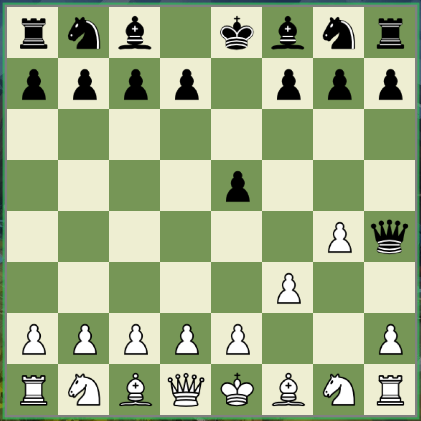

`GUI UI inspired from:` https://www.chess.com

`Chess Piece from:` https://commons.wikimedia.org/wiki/Category:PNG_chess_pieces/Standard_transparent
t 
## Welcome to the game of Chess
* A simple chess GUI game made using javax.swing for my Final AP-CSA project. Two players can play LOCALLY against each other. 

`Don't know how to play? a great 12 minutes tutorial ->` https://www.youtube.com/watch?v=mGuYHXfgDxY

## Inheritance: 
    [Parent] Piece -> [Child] Pawn, Knight, Bishop, Rook, King, Queen. 

### Game status:
#### Jun 8, 2021: `players can move their pieces on any square (excluding squares which is occupied with its own royalist).`

